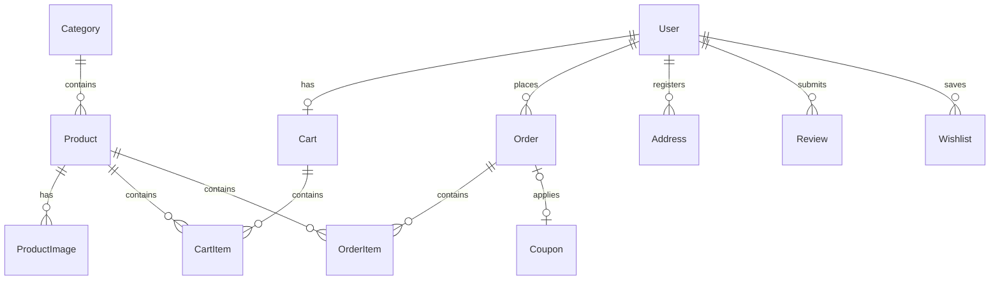

# Veloura — Full-Stack Luxury Fashion E-Commerce Platform

Veloura is a premium, full-stack online fashion marketplace. Shoppers can browse categories, filter/search garments, save items to a wishlist, manage a persistent server-side cart, check out via a simulated transactional flow, rate products, and review order histories. A dedicated administration console provides catalog management, image uploads (saved locally), coupon definition, and real-time sales performance metrics.

--- live demo - https://veloura-ai-two.vercel.app/

## 1. Tech Stack & Rationale

*   **Next.js 15 (App Router)**: Unified full-stack framework allowing React server and client components to run alongside protected backend API route handlers under a single codebase.
*   **Prisma ORM & PostgreSQL**: A robust relational database schema with referential integrity. Running in a Docker Compose container ensures portability and isolated local development.
*   **JWT Credentials Auth**: Authentication handled securely using JSON Web Tokens (JWT) stored in secure HTTP-only cookies, combined with Next.js edge-safe middleware route protection.
*   **Tailwind CSS & Lucide Icons**: A curated design system implementing a high-end editorial luxury aesthetic (zinc dark background, slate text, gold accent tags).
*   **Recharts**: Interactive dashboard charts for admin analytics (monthly revenue trends, category sales distributions).

---

## 2. Project Architecture & Database Schema

The database model is fully normalized to guarantee transactional safety (e.g. stock level depletion cannot drop below zero, and coupon usage tracking).



### Core Entities:
*   **User**: Shoppers and Administrators distinguished by a role flag (`USER`, `ADMIN`). Passwords are encrypted using standard salt rounds (bcrypt).
*   **Product & Category**: Product catalog modeling sizes (`S, M, L, XL`), colors, status (`ACTIVE` or `DRAFT`), and stock quantities.
*   **Cart & CartItem**: Persisted entirely server-side. Syncs automatically from local storage once a guest shopper logs in.
*   **Order & OrderItem**: Snapshot records locking in purchase prices, sizes, and colors. Decrements stock inside a database transaction block.
*   **Coupon**: Promo codes supporting percentage or flat currency subtractions, minimum order values, and global usage limits.
*   **Review & Wishlist**: Social attributes to toggle saved items or submit star ratings (1 to 5 stars).

---

## 3. Local Setup Instructions

Ensure you have **Node.js (v20+)**, **npm (v10+)**, and **Docker Desktop** installed on your system.

### Step 1: Clone and Enter Project Directory
```bash
git clone <repository-url>
cd "e commcerse app"
```

### Step 2: Spin Up the PostgreSQL Container
We run PostgreSQL inside a Docker container mapped to port **`5435`** to prevent collisions with other system databases:
```bash
docker-compose up -d
```
Verify the container is running:
```bash
docker ps
```

### Step 3: Configure Environment Variables
Copy the env example template to make your active local variables file:
```bash
cp .env.example .env
```
*(The default connection string in `.env` is pre-configured to interface with the Docker container automatically).*

### Step 4: Run Database Migrations
Create the SQL schemas and compile the Prisma Client:
```bash
npx prisma migrate dev --name init
```

### Step 5: Seed Sample Data
Populate the database with categories, promo codes, demo accounts, and **20 sample fashion garments**:
```bash
npx prisma db seed
```

### Step 6: Start local Development Server
```bash
npm run dev
```
Open [http://localhost:3000](http://localhost:3000) on your browser.

---

## 4. Run Automated Integration Tests

An automated test suite verifies password hashing, JWT checks, transactional order placement, and inventory stock subtraction bounds.
```bash
npx tsx scripts/test-auth-order.ts
```

---

## 5. Demo Login Credentials

You can sign in using these pre-seeded demo accounts:

### Regular Customer (Shopper)
*   **Email**: `shopper@luxury.com`
*   **Password**: `password123`

### Administrator (Admin)
*   **Email**: `admin@luxury.com`
*   **Password**: `admin123`

---

## 6. Project Layout Folder Structure

```
fashion-commerce/
├── app/                  # Next.js App Router Pages & APIs
│   ├── api/              # API Route Handlers (Auth, Cart, Products, Orders, Uploads, Reviews)
│   ├── admin/            # Protected Admin Dashboard view components
│   ├── products/         # Shopper Catalog Lists & Detail Views
│   ├── cart/             # Shopping Cart view
│   ├── checkout/         # Transaction checkout view
│   ├── orders/           # Customer Order history and Invoice views
│   ├── wishlist/         # Customer Saved items list
│   ├── login/            # Sign in view
│   ├── signup/           # Register view
│   ├── layout.tsx        # Base template (wraps Contexts & Navbars)
│   └── globals.css       # Core Luxury Theme stylesheet
├── components/           # Reusable View Components (Navbar, Footer, Charts)
├── context/              # Client State providers (AuthContext, CartContext)
├── lib/                  # Server-side Utilities (Prisma Client, JWT signers, Auth Helpers)
├── prisma/               # Data definitions & Seed script
└── scripts/              # Automated Test Runner script
```

---

## 7. Features Implemented

### Tier 1 (Baseline)
*   **Persisted Database**: Normalised schemas matching PostgreSQL rules.
*   **Secure Authentication**: JWT tokenized credentials set inside HTTP-only cookies.
*   **Protected Routes**: Next.js Edge-safe middleware redirects unauthorized users.
*   **Product Listings**: Browsing list and detail pages featuring multiple sizes and colors.
*   **Persistent Server Cart**: Cart data survives tab reload/re-login.
*   **Checkout Stock Depletion**: Checkout decrement counts inside database transactions.
*   **Separate Admin Panel**: Dedicated interface for catalog products and order updates.
*   **Pre-populated Seeds**: Seeding 20 products, categories, coupons, and test users.

### Tier 2 (Should-Have)
*   **Search & Filtering**: Search text box, category sidebars, price range inputs, sizing, and color check options.
*   **Sorting**: Sort listings by Newest or Price.
*   **Wishlist**: Saved items toggle with instant cart addition capabilities.
*   **Form Validations**: Detailed error checking (e.g., password length, out-of-stock warning alerts).
*   **Responsive Layout**: Optimized CSS flex/grids for mobile viewports.
*   **Interactive Timeline**: Stepper (Placed -> Processing -> Shipped -> Delivered) visible to shoppers.

### Tier 3 (Bonus)
*   **Product Reviews**: Star ratings (1-5) and comment logs with reviewer headers.
*   **Promo Coupon Codes**: Applied percentages or currency reductions at checkout.
*   **Local Image Upload**: Consoles write files directly to `/public/uploads/` on the host directory.
*   **Simulated PDF Invoices**: Standard printer formatting on receipts via `window.print()`.
*   **Automated Tests**: Script testing user registration, password matches, and inventory transaction bounds.
*   **Docker Containerization**: Port-mapped database service.

---

## 8. Known Limitations & Future Scope

*   **No Image Compression**: Uploaded images are saved directly. In a production environment, I would connect this to Cloudinary or AWS S3 to optimize weight.
*   **In-Memory State caching**: The search page refetches items. Implementing state caching via TanStack Query (React Query) would improve load speeds.
*   **Admin User Registration**: Admin accounts can only be seeded. Real-world systems require specialized verification protocols to invite administrators.

---

## 9. AI Assistance Notes

LLMs were utilized during this build to:
1. Scaffold Next.js App Router routing boilerplate and structure.
2. Outline the initial database ER diagrams.
3. Configure the standard SVG parameters for Recharts coordinates.
