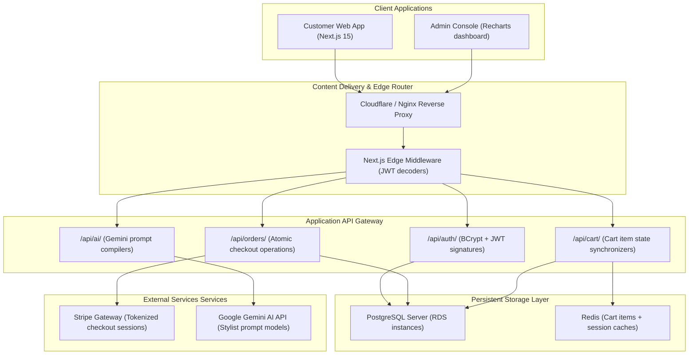

# System Architecture Specification

Below is the production monorepo deployment architecture designed for the Veloura AI fashion platform.

### Components Curation
1. **Next.js 15 Edge Middleware**: Intercepts requests to `/checkout`, `/orders`, and `/admin`. Parsers decode base64 payloads to run route protections.
2. **Prisma Client ORM**: Encapsulates PostgreSQL database connections inside a connection pool. Enforces strict schema normalization.
3. **Stripe Payments integration**: Initializes Stripe session IDs. Webhook listener parses checkout notifications to flag invoice fulfillment status.
