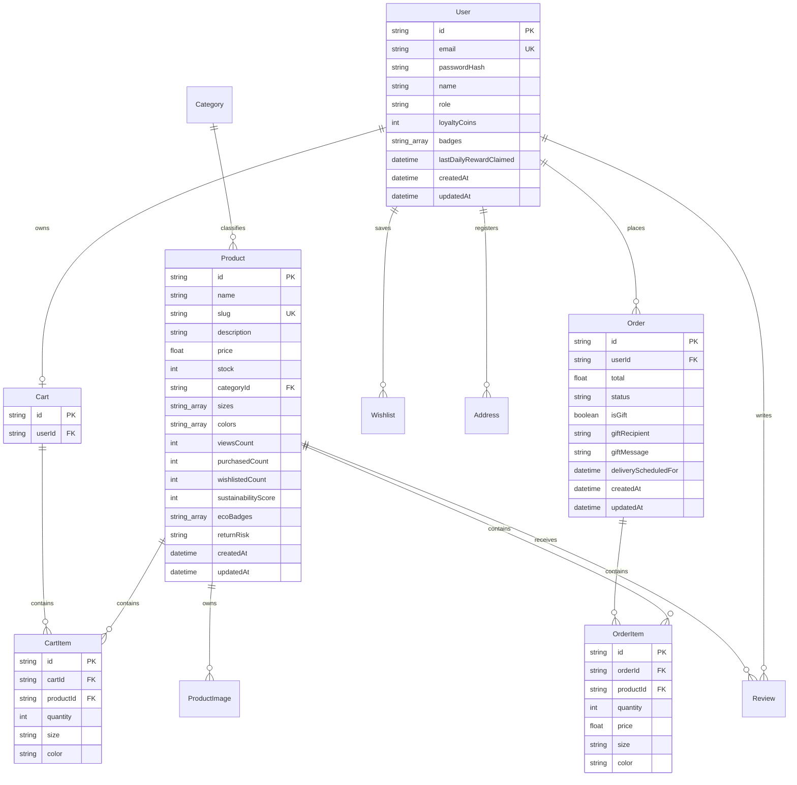

# Database ER Diagram Specification

Below is the normalized database schema designed for Veloura's persistent PostgreSQL layer.

```mermaid
erDiagram
    User ||--o| Cart : "owns"
    User ||--o{ Order : "places"
    User ||--o{ Review : "writes"
    User ||--o{ Wishlist : "saves"
    User ||--o{ Address : "registers"
    
    Category ||--o{ Product : "classifies"
    Product ||--o{ ProductImage : "owns"
    Product ||--o{ CartItem : "contains"
    Product ||--o{ OrderItem : "contains"
    Product ||--o{ Review : "receives"
    
    Cart ||--o{ CartItem : "contains"
    Order ||--o{ OrderItem : "contains"

    User {
        string id PK
        string email UK
        string passwordHash
        string name
        string role
        int loyaltyCoins
        string_array badges
        datetime lastDailyRewardClaimed
        datetime createdAt
        datetime updatedAt
    }

    Product {
        string id PK
        string name
        string slug UK
        string description
        float price
        int stock
        string categoryId FK
        string_array sizes
        string_array colors
        int viewsCount
        int purchasedCount
        int wishlistedCount
        int sustainabilityScore
        string_array ecoBadges
        string returnRisk
        datetime createdAt
        datetime updatedAt
    }

    Cart {
        string id PK
        string userId FK
    }

    CartItem {
        string id PK
        string cartId FK
        string productId FK
        int quantity
        string size
        string color
    }

    Order {
        string id PK
        string userId FK
        float total
        string status
        boolean isGift
        string giftRecipient
        string giftMessage
        datetime deliveryScheduledFor
        datetime createdAt
        datetime updatedAt
    }

    OrderItem {
        string id PK
        string orderId FK
        string productId FK
        int quantity
        float price
        string size
        string color
    }
```
